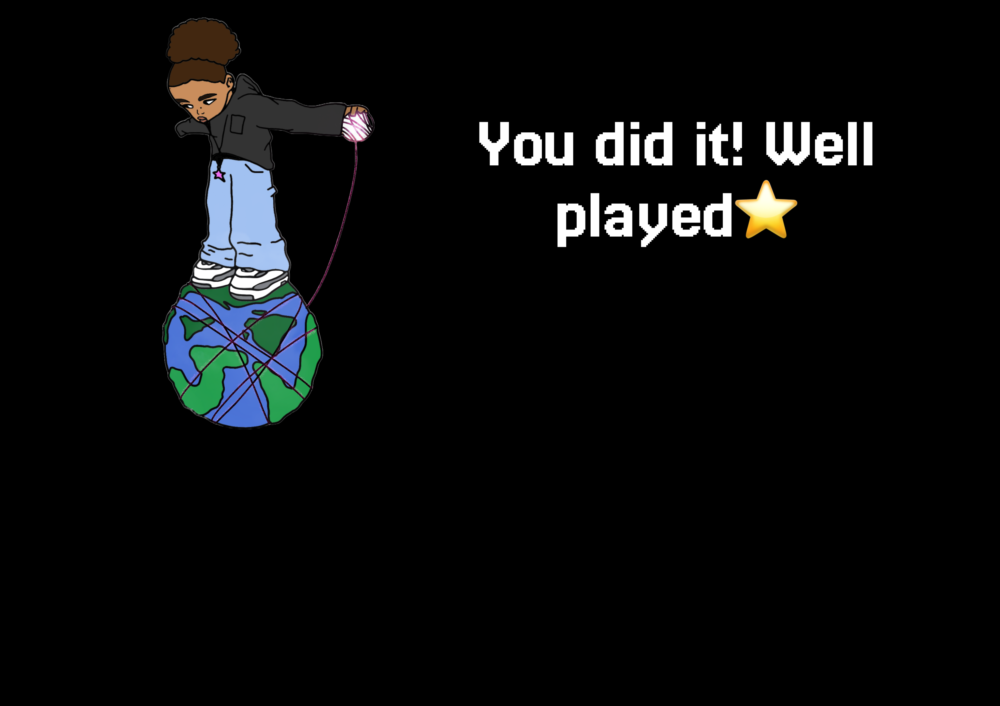

# 🎮 **Game Title** 

> **Short Pitch**: My game is a 2D jump-and-run platformer where the player has to defeat enemies, collect items, and reach a portal in order to progress to the next level. The player assumes the role of a former fashion designer who now seeks to bring balance back to a fractured multiverse after the Magical String of Love was shattered.

Armed with the Magical String, players will be enabled to take part in fast-paced combat, collecting items and defeating enemies deftly to unlock the portal at the end of each level. Every stage brings new challenges, enemies, and environments that demand skillful movement and precise attacks. The game is all about fluid platforming, engaging enemy encounters, and rewarding progression, making each level a test of agility and combat strategy.
---

## 🌐 **Play the Game**
[Click here to play the game!](https://sarahverena.github.io/CCL_SarahFurrer1/)

---

## 📸 **Screenshots**

### Main Gameplay:

  
  
  
 Example of gameplay in action.*

---

### Screens:

  
  
  
  

---

## 🎨 **Spritesheets**
Below are the sprites used to create characters and objects in the game:

### Player Character:

  
  
*Figure 3: Player character animations.*

---

### Enemies and NPCs:

  
  
*Figure 4: Enemy animations.*

---

## ✍️ **Reflection**

### What went well:
- **Creative Design:** I really liked everything that I designed, although it was really hard to draw all the spritesheets
- **Core Mechanics:** It was pretty okay to implement the gravity and everything based on Lukas template. But all in one, things like shooting a weapon realistically, is way easier to do in our heads than in coding. But at the end it is incredible what you can do with coding.

### Challenges:
- **Debugging** after changing one little thing, there is a high chance that everything suddenly doesnt work anymore. Buth with patience, chocolate and help form tutors and friends, it is fine and you gon make it work.
- **Spritesheets:** making the spritesheets realistically and look good was way harder than expected

### Lessons Learned:
- **Trust the process** Progress takes time, and setbacks are part of growth, even in developing a game. At the end of the day every step you take, gets you closer to your goal. Even if you dont see all the progress, at the end it will be worth it
- **Quality over Quantity** Focusing on one unique mechanic instead of multiple features made the game more polished.
